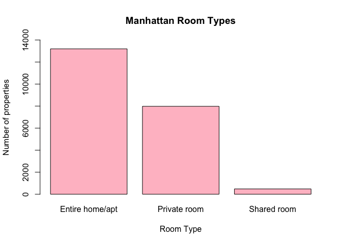
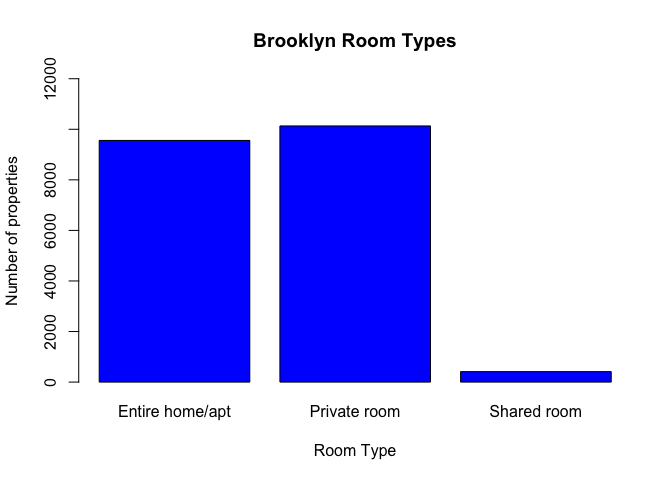
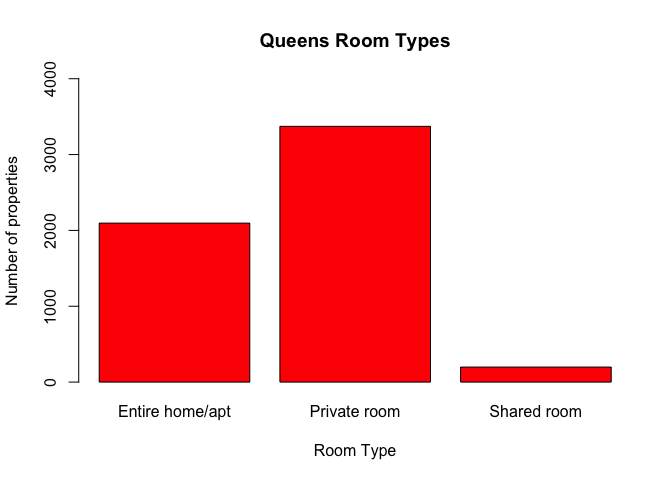
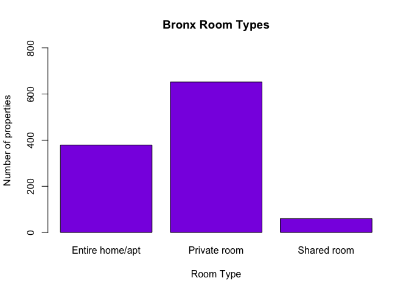
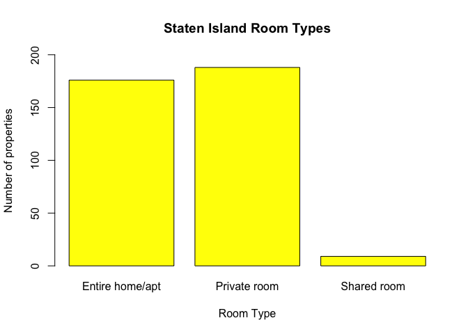
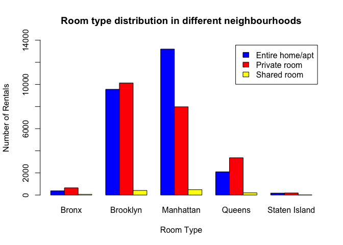
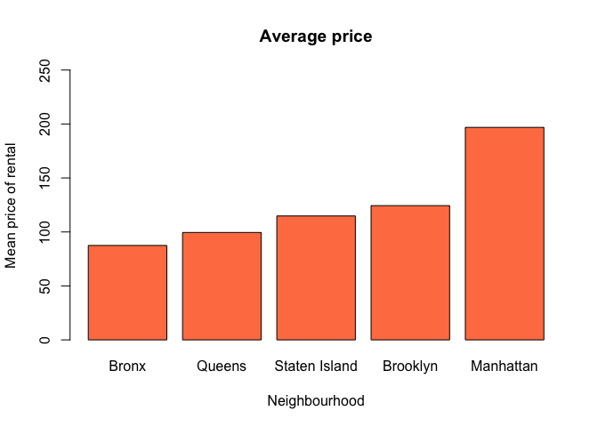
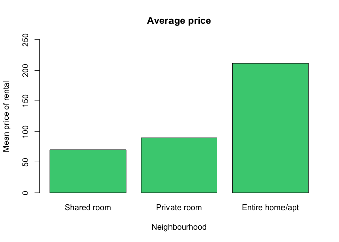
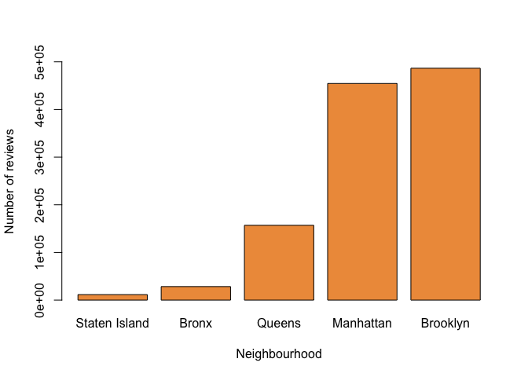

AirBnB in New York City
================
Shivangi Khanna
2/4/2020

### Airbnb-NYC Data

This dataset contains all information about hosts, availability, room
types for the Airbnbs in New York City.

###### Reading data in files

``` r
airbnb <- read.csv("AB_NYC_2019.csv")
```

###### Structure of dataframe

``` r
str(airbnb)
```

    ## 'data.frame':    48895 obs. of  16 variables:
    ##  $ id                            : int  2539 2595 3647 3831 5022 5099 5121 5178 5203 5238 ...
    ##  $ name                          : Factor w/ 47906 levels ""," 1 Bed Apt in Utopic Williamsburg ",..: 12573 38016 45018 15591 19219 24849 8257 24896 15486 17573 ...
    ##  $ host_id                       : int  2787 2845 4632 4869 7192 7322 7356 8967 7490 7549 ...
    ##  $ host_name                     : Factor w/ 11453 levels "","​ Valéria",..: 4997 4791 2913 6210 5929 1938 3549 9649 6880 1235 ...
    ##  $ neighbourhood_group           : Factor w/ 5 levels "Bronx","Brooklyn",..: 2 3 3 2 3 3 2 3 3 3 ...
    ##  $ neighbourhood                 : Factor w/ 221 levels "Allerton","Arden Heights",..: 109 128 95 42 62 138 14 96 203 36 ...
    ##  $ latitude                      : num  40.6 40.8 40.8 40.7 40.8 ...
    ##  $ longitude                     : num  -74 -74 -73.9 -74 -73.9 ...
    ##  $ room_type                     : Factor w/ 3 levels "Entire home/apt",..: 2 1 2 1 1 1 2 2 2 1 ...
    ##  $ price                         : int  149 225 150 89 80 200 60 79 79 150 ...
    ##  $ minimum_nights                : int  1 1 3 1 10 3 45 2 2 1 ...
    ##  $ number_of_reviews             : int  9 45 0 270 9 74 49 430 118 160 ...
    ##  $ last_review                   : Factor w/ 1765 levels "","2011-03-28",..: 1503 1717 1 1762 1534 1749 1124 1751 1048 1736 ...
    ##  $ reviews_per_month             : num  0.21 0.38 NA 4.64 0.1 0.59 0.4 3.47 0.99 1.33 ...
    ##  $ calculated_host_listings_count: int  6 2 1 1 1 1 1 1 1 4 ...
    ##  $ availability_365              : int  365 355 365 194 0 129 0 220 0 188 ...

##### Here is what the following column names represent:

| Column Name                       | What Column Name Represents                          |
| :-------------------------------- | :--------------------------------------------------- |
| id                                | Listing ID                                           |
| name                              | Name of listing                                      |
| host\_id                          | Host ID                                              |
| host\_name                        | Name of the host                                     |
| neighbourhood\_group              | Location                                             |
| neighbourhood                     | Area                                                 |
| latitude                          | Latitude coordinates                                 |
| longitude                         | Longitude coordinates                                |
| room\_type                        | Listing space type                                   |
| price                             | Price in USD                                         |
| minimum\_nights                   | Minimum number of nights                             |
| number\_of\_reviews               | Number of reviews                                    |
| last\_review                      | Latest review                                        |
| reviews\_per\_month               | Number of reviews per month                          |
| calculated\_host\_listings\_count | Number of listings per host                          |
| availability\_365                 | Number of days when listing is available for booking |

-----

From the structure output, we see that id and host\_id are treated as
int values rather than factors. So we will convert them into factor
values.

``` r
airbnb$id <- as.factor(airbnb$id)
airbnb$host_id <- as.factor(airbnb$host_id)
```

To check if any of the entries has been repeated,

``` r
unique_id <- unique(airbnb$id)
if (length(unique_id) == length(airbnb$id)) {
  print("No duplicate entries")
} else {
  print("Duplicate entries found")
}
```

    ## [1] "No duplicate entries"

We will now find out what neighbourhoods and room types are listed in
this dataframe, and how they are
    distributed.

``` r
summary(airbnb$neighbourhood_group)
```

    ##         Bronx      Brooklyn     Manhattan        Queens Staten Island 
    ##          1091         20104         21661          5666           373

``` r
summary(airbnb$room_type)
```

    ## Entire home/apt    Private room     Shared room 
    ##           25409           22326            1160

  - We see that there are more airbnbs in Brooklyn and Manhattan as
    compared to the other areas.  
  - We also notice that the number of shared rooms is significantly less
    in comparison to other room types.

-----

New York is divided into 5 main neighbourhood
groups.

<center>


</center>

Let’s take a look at the data specifically from different neighbourhood
groups:

#### Manhattan

``` r
manhattan_airbnb <- airbnb[which(airbnb$neighbourhood_group == "Manhattan"),]
manhattan_table <- table(manhattan_airbnb$room_type)
manhattan_table
```

    ## 
    ## Entire home/apt    Private room     Shared room 
    ##           13199            7982             480

``` r
barplot(manhattan_table, main = "Manhattan Room Types", xlab = "Room Type", ylab = "Number of properties", col = "Pink", ylim = c(0, 14000))
```

<!-- -->

#### Brooklyn

``` r
brooklyn_airbnb <- airbnb[which(airbnb$neighbourhood_group == "Brooklyn"),]
brooklyn_table <- table(brooklyn_airbnb$room_type)
brooklyn_table
```

    ## 
    ## Entire home/apt    Private room     Shared room 
    ##            9559           10132             413

``` r
barplot(brooklyn_table, main = "Brooklyn Room Types", xlab = "Room Type", ylab = "Number of properties", col = "Blue", ylim = c(0, 12000))
```

<!-- -->

#### Queens

``` r
queens_airbnb <- airbnb[which(airbnb$neighbourhood_group == "Queens"),]
queens_table <- table(queens_airbnb$room_type)
queens_table
```

    ## 
    ## Entire home/apt    Private room     Shared room 
    ##            2096            3372             198

``` r
barplot(queens_table, main = "Queens Room Types", xlab = "Room Type", ylab = "Number of properties", col = "Red", ylim = c(0, 4000))
```

<!-- -->

#### Bronx

``` r
bronx_airbnb <- airbnb[which(airbnb$neighbourhood_group == "Bronx"),]
bronx_table <- table(bronx_airbnb$room_type)
bronx_table
```

    ## 
    ## Entire home/apt    Private room     Shared room 
    ##             379             652              60

``` r
barplot(bronx_table, main = "Bronx Room Types", xlab = "Room Type", ylab = "Number of properties", col = "blueviolet", ylim = c(0, 800))
```

<!-- -->

#### Staten Island

``` r
staten_airbnb <- airbnb[which(airbnb$neighbourhood_group == "Staten Island"),]
staten_table <- table(staten_airbnb$room_type)
staten_table
```

    ## 
    ## Entire home/apt    Private room     Shared room 
    ##             176             188               9

``` r
barplot(staten_table, main = "Staten Island Room Types", xlab = "Room Type", ylab = "Number of properties", col = "Yellow", ylim = c(0, 200))
```

<!-- -->

For a better comparitive view, we can view it together,

``` r
counts <- table(airbnb$room_type, airbnb$neighbourhood_group)
barplot(counts, main = "Room type distribution in different neighbourhoods", xlab = "Room Type", ylab = "Number of Rentals", col = c("blue", "red", "yellow"), legend = rownames(counts), beside = TRUE, ylim = c(0, 14000))
```

<!-- -->

After having a look at all these results, we can conclude the following:

  - The percentage of entire homes/apartments available for rent in a
    particular neighbourhood is the greatest in Manhattan.
  - The percentage of private rooms available for rent in a particular
    neighbourhood is the greatest in Queens and Bronx.

-----

Now, let’s compare the prices across different neighbourhood groups, and
room
types.

``` r
avg_price_neighbourhood <- tapply(airbnb$price, airbnb$neighbourhood_group, mean)
barplot(sort(avg_price_neighbourhood), main = "Average price", xlab = "Neighbourhood", ylab = "Mean price of rental", col = "Coral", ylim = c(0, 250))
```

<!-- -->

``` r
avg_price_roomtype <- tapply(airbnb$price, airbnb$room_type, mean)
barplot(sort(avg_price_roomtype), main = "Average price", xlab = "Neighbourhood", ylab = "Mean price of rental", col = "seagreen3", ylim = c(0, 250))
```

<!-- -->

The average rental price in manhattan is the highest in Manhattan. It is
almost twice the average rental price in Bronx, which is the lowest.  
This probably has connection to the fact that the number of entire
home/apartment rentals are greater in Manhattan, which have higher
prices.

-----

Are the number of reviews dependent on the neighbourhood of the rental
property? Let’s find
out.

``` r
review_neighbour <- tapply(airbnb$number_of_reviews ,airbnb$neighbourhood_group, sum)
barplot(sort(review_neighbour), xlab = "Neighbourhood", ylab = "Number of reviews", col = "tan2",  ylim = c(0, 500000))
```

<!-- -->

The answer to the above question is well evident. There is a relation,
but there can be bias as the number of rentals from each neighbourhood
is not equal. To get a clearer answer we need to collect data with an
equal distributuion, which is next to impossible, because we cannot ask
Airbnb to start new rentals or close some of the existing ones.

-----
